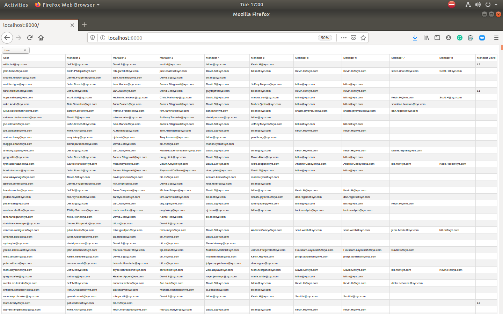

# Manager-Hierarchy-Script

## About the Script

This is a script written in python which is used to get generates a file with the managers' hierarchy and their own level for each user.

    1. Takes input json dataset named sample_dataset.json in the directory named sample_input inside managers_hierarchy_api folder
    2. Process it
    3. Create a csv file containing the hierarchy of managers for each user according to the highest level to lowest
    4. Output of this script get stored in the file sample_output.csv in the directory named sample_output inside managers_hierarchy_api folder

## Prerequisites
- python==3.6.9
- Django==3.0.3
- djangorestframework==3.11.0
- pandas==1.0.0

# Steps to run the script

- Go to the root directory and run the below command
- python hierarchy_webservice/manage.py runserver
  - if running the script for the first time or have updated the input csv file, go to the following url on the browser:
    - [Update the Data](http://localhost:8000/data)

  - if want to see data on the browser, go to the following url where you'll be able to see the data processed and stored in the csv with additional formatting:
    - [Get Available Data](http://localhost:8000/)
    

</a>